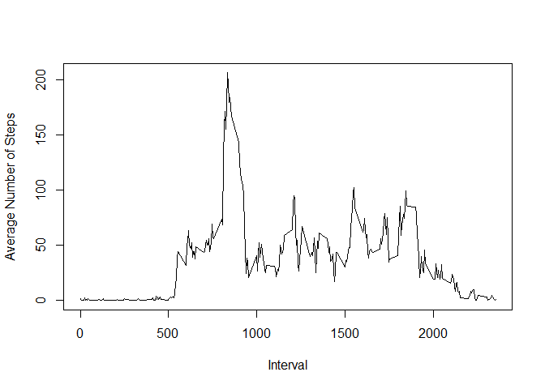
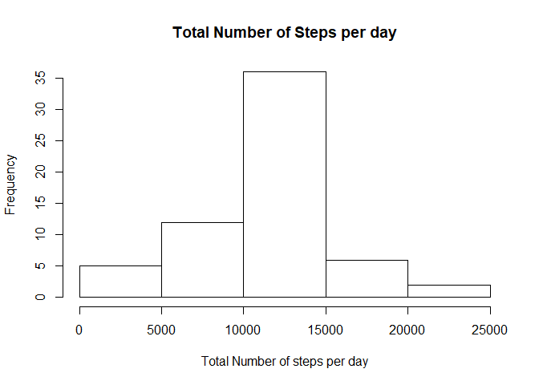
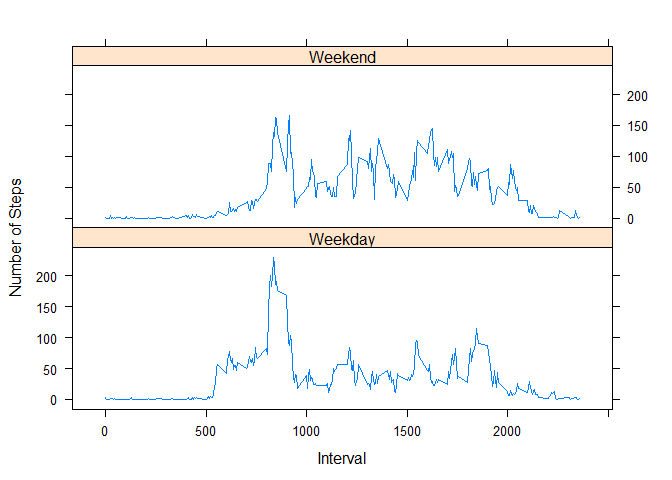

---


## Loading and preprocessing the data

```r
library(lubridate)
```

```
## 
## Attaching package: 'lubridate'
```

```
## The following object is masked from 'package:base':
## 
##     date
```

```r
library(lattice)
data<-read.csv("activity.csv")
```
## What is mean total number of steps taken per day?

In this question, we are going to:-
1) Calculate the total Number of steps per day
2)Make a Histogram of the Total Number of Steps Eaach day
3)Report Mean and Median of the Total Number of steps per day

For the histogram, I would like to state certain assumptions that I made since the Question was Ambiguous.
The assumptions are:

1) I understood the question as a Histogram with Total Number of steps for a day on the x axis and the frequency on the Y axis.

2) I removed all the rows with step value as NA from my data.

The Code I used was:-

```r
  logic<-is.na(data$steps)
  logic<-!logic
  datamod<-data[logic,]
  steps<-aggregate(datamod$steps, list(datamod$date), sum)
  hist(steps$x, xlab = "Total Number of steps per day", main = "Total Number of Steps per day")
```

<!-- -->

```r
  Mean<-mean(steps$x)
  Median<-median(steps$x)
  print(paste("The mean of Total Number of steps per day ", Mean))
```

```
## [1] "The mean of Total Number of steps per day  10766.1886792453"
```

```r
  print(paste("The median of Total Number of steps per day ", Median))
```

```
## [1] "The median of Total Number of steps per day  10765"
```


## What is the average daily activity pattern?

For this question, I am going to take the average number of steps walked in a given interval for all the days for which the data was obtained and using this construct a data frame.I am using this data to make a line plot and from observation and R functions, one can predict the max value of this Average Number of steps.

The code i used was:-

```r
average<-aggregate(datamod$steps,list(datamod$interval), mean)
 plot(average$Group.1,average$x, type = "l", xlab = "Interval", ylab = "Average Number of Steps")
```

<!-- -->

It is clear that the maximum value occurs between the intervals 500 and 1000.

Now to find the actual Interval

```r
maxinterval<-average[(average$x==max(average$x)),1]
paste("The Interval where the maximum number of steps are taken is ", maxinterval)
```

```
## [1] "The Interval where the maximum number of steps are taken is  835"
```

## Imputing missing values

If one notices the dataset, there are missing values which we removed when we worked on the dataset.Now we want to modify this dataset by changing the NA values to the mean of the total number of steps taken in that Interval over the various days.

This modification of the data might give us more accurate conclusions to work on the data furthur on.

The objectives are:-

1) Calculate and report the total number of missing values in the dataset (i.e. the total number of rows with NAs)

2) Devise a strategy for filling in all of the missing values in the dataset. The strategy does not need to be sophisticated. For example, you could use the mean/median for that day, or the mean for that 5-minute interval, etc.

3) Create a new dataset that is equal to the original dataset but with the missing data filled in.

4) Make a histogram of the total number of steps taken each day and Calculate and report the mean and median total number of steps taken per day. Do these values differ from the estimates from the first part of the assignment? What is the impact of imputing missing data on the estimates of the total daily number of steps?

**Part 1**

```r
  logic<-is.na(data$steps)
  NoofNA<-sum(logic)
  paste("The number of Rows with missing Data", NoofNA)
```

```
## [1] "The number of Rows with missing Data 2304"
```

**Part 2**

I am going to create the new dataset with the missing data filled in.With this new data, I will plot a Histogram.

```r
  newdata<-data
  a<-nrow(newdata)
  for (i in 1:17568) 
 {
     if(is.na(newdata$steps[i]))
     {
         newdata$steps[i]=average[average$Group.1==newdata$interval[i],2]
     }
 }
  steps<-aggregate(newdata$steps, list(newdata$date), sum)
  hist(steps$x, xlab = "Total Number of steps per day", main = "Total Number of Steps per day")
```

<!-- -->

These values did not change the Histogram a lot except the fact that 8 more observations got added to the data and the bars raised by a bit.

Now we will calculate the mean and median of the total steps taken. The code and the result is as follows:

```r
  Mean2<-mean(steps$x)
  Median2<-median(steps$x)
  print(paste("The new mean of Total Number of steps per day ", Mean2))
```

```
## [1] "The new mean of Total Number of steps per day  10766.1886792453"
```

```r
  print(paste("The new median of Total Number of steps per day ", Median2))
```

```
## [1] "The new median of Total Number of steps per day  10766.1886792453"
```

If one noticed the mean and median, there wasn't much of a difference because the new data was based on mean values that we obtained and this does not really change the properties of the dataset as a whole.

## Are there differences in activity patterns between weekdays and weekends?

For this part the weekdays() function may be of some help here. Use the dataset with the filled-in missing values for this part.

1) Create a new factor variable in the dataset with two levels - "weekday" and "weekend" indicating whether a given date is a weekday or weekend day.

2) Make a panel plot containing a time series plot (i.e. \color{red}{\verb|type = "l"|}type="l") of the 5-minute interval (x-axis) and the average number of steps taken, averaged across all weekday days or weekend days (y-axis). See the README file in the GitHub repository to see an example of what this plot should look like using simulated data.


```r
  library(lubridate)
  newdata$date<-ymd(newdata$date)
  newdata$day<-weekdays(newdata$date)
  for (i in 1:17568) {
  if(newdata$day[i]%in%c("Monday","Tuesday","Wednesday","Thursday","Friday"))
  {
    newdata$day[i]="Weekday"
  }
  else
  {
    newdata$day[i]="Weekend"
  }
}
weekday<-newdata[newdata$day=="Weekday",]
weekend<-newdata[newdata$day=="Weekend",]
average<-aggregate(weekday$steps,list(weekday$interval), mean)
average2<-aggregate(weekend$steps,list(weekend$interval), mean)
total<-rbind(average,average2)
days<-c(rep("Weekday",288),rep("Weekend",288))
total$day<-days
colnames(total)<-c("Interval","Number of Steps","day")
library(lattice)
xyplot(`Number of Steps` ~ Interval | day, data = total, layout=c(1,2), type="l")
```

<!-- -->
